```{r setup, include=FALSE}
knitr::opts_chunk$set(echo = FALSE)
```

# a.	Critique of Data Visualization
### Clarity
- The purpose of this chart is to compare the change of the percentage of Labour in 2009 with that in 2019. However, the title is misleading or incomplete. The title only mentions the age but does not mention the year.
- The lack of Y-axis as a reference for data makes it impossible for us to observe specific differences. There is also lack of the tick mark, which tells us the value of each point so that we can make comparisons. The only thing we can tell from the chart is that the age group of the workforce in 2009 was younger than 55 than in 2019, but by how much?
- It is not accurate enough. If the title indicates that the whole calculation process is a percentage, then the table at the bottom should also indicate that it is a percentage. However, the figure only shows the data and does not explain the number format
- It is a mistake to use the chart. According to the above meaning and the meaning expressed in the picture, we want to compare the differences of each age group between 2009 and 2019. However, the problem is that line chart and line chart are suitable for comparing trends, such as the rise and fall of stocks. I believe that line chart is not the most suitable chart in this visual analysis.

### Aesthetic
- The combination of colours is not eye-catching
- Legend is missing. Normally, which year represents what colour should be displayed in the upper right corner to help readers distinguish more easily
- The table at the bottom affects aesthetics. Readers need to spend more time extracting the data of each age group. At the same time, there are too many words in the icon, which makes it very cumbersome
- While the text is too cumbersome, the two lines are too simple. The details of the lines should be changed

# b.	Way to improve current design
### Critique from Clarity
- Title needs to be precise. It can be changed as “Resident labor force change between Year 2009 and Year 2019 by age”
- Add Y-axis as a reference on the chart and the calculation format should be percentage 
- Add value label on each point to clearly show the different between Year 2009 and Year 2019
- After careful consideration and attempt, I suggest using bar chart to compare the differences between each age group in 2009 and 2019. The advantage of bar chart is that it can effectively display the differences and values

### Critique from aesthetic
- Using color such as blues and oranges can add simplicity and aesthetics to a chart
- Add legend on the right top corner to identify the color and category
- Create a new dashboard, which first summarizes the differences between 2009 and 2019, at the same time, create the labor differences between men and women, and then refine the data to a single age period such as age 15-19 from 2009 to 2019 based on data.
- Avoid adding too much text to simplify the graph. Mention the main point is good enough.

### Sketch of Proposed Design 

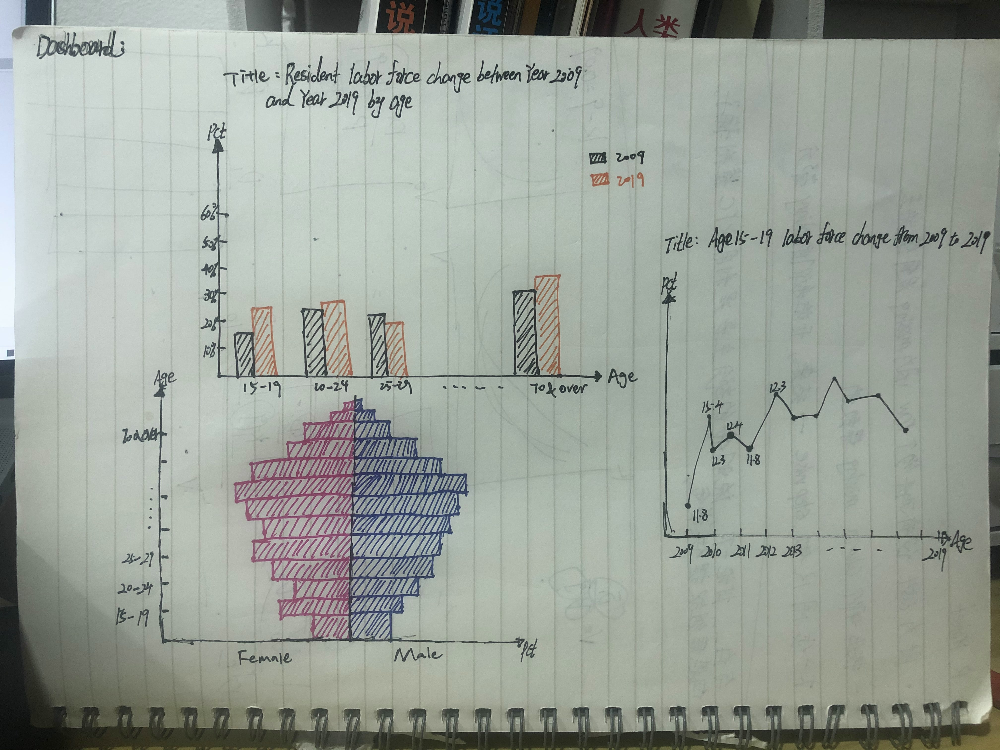

- **First bar chart is my main chart. Besides, Pyramid and Line chart are for detail comparison.**The first chart is a bar chart. Before that, my research direction is to enable the audience to see the comparison of the change of labor in each age group between 2009 and 2019. I want to compare the proportion of labor in 2009 and 2019 through the height of the bar chart. Y-axis is percentage and X-axis is age. Compared with the previous graph, the bar chart can more accurately reflect the change of each age level between 2009 and 2019, and the visual effect is more intuitive.

- The second chart is Pyramid chart. I plan to integrate the data of male and female together and make a comparison by integrating the data, and the year is used as a filter, so that we can browse the labor ratio of male and female in different age groups in different year.

-	The third graph is a simple line graph, but I mainly want to observe the trend change of a specific age group from 2009 to 2019, so I think the graph is the best way to reflect the trend change. By setting the age group as FILTER, we can observe the trend change of each age group from 2009 to 2019.


# c.	Step -by-step Description on Data Visualization Design Process(c& d combine into one)
### Action

Inspecting the raw excel data file

- 	We see that there are three sheets in the data set, which are the changes of total labor force, male labor force and female labor force from 2009 to 2019.

- Based on the data, we can make a graph of the change for each age group in 2009 and 2019. The best graph to show the change is the bar chart. Then we can make a pyramid chart to show the change for men and women

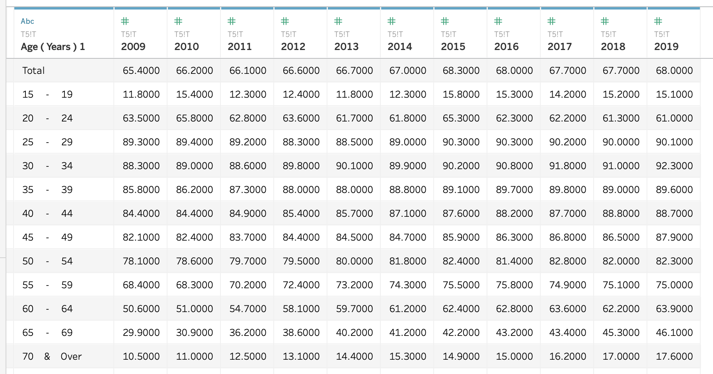

Extra Data Clean Process
- When we import Data and find that every column and row have NULL values, we can use function-Use Data Interpreter, and **Data Interpreter** will help us automatically exclude NULL values and organize the Data


## **Bar Chart**
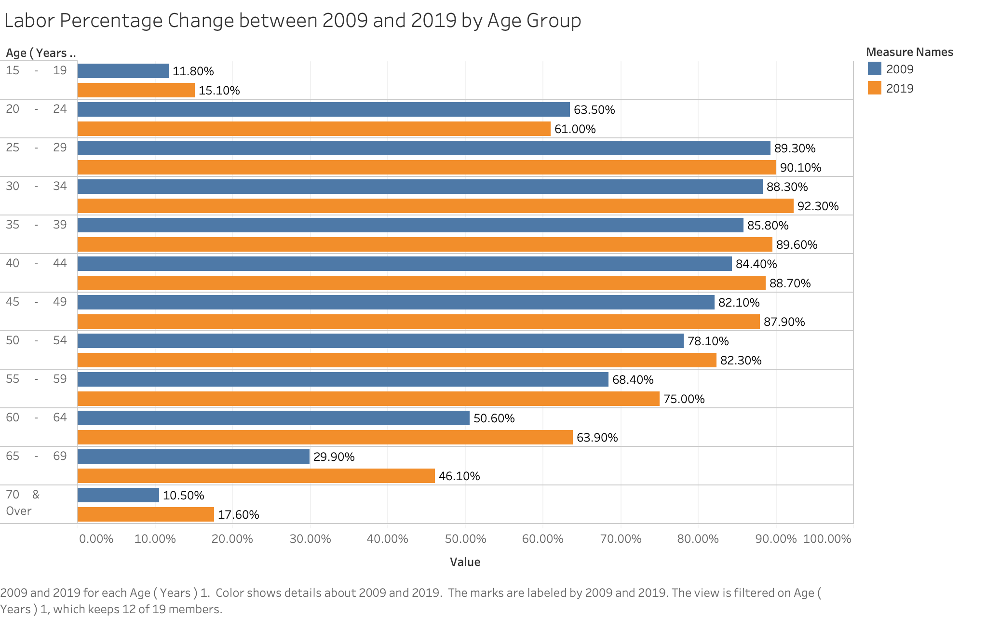

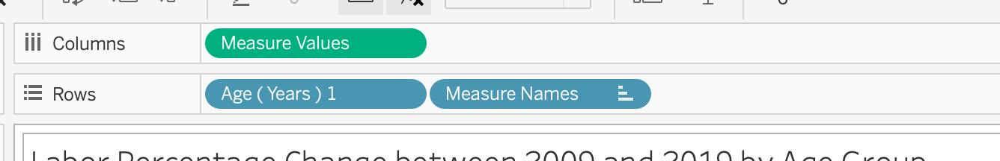

- First of all, the big difference between the graph and my Scratch design is that the Y axis is changed into age, while the X axis is changed into percentage. In this way, the changes of different age groups in 2009 and 2019 can be better displayed

- I put the measure name in the filter to screen out the two years of 2009 and 2019 for comparison. The advantage of this is that I can change the target of comparison at any time. I also put variable age in the filter to get rid of total and null, because they are not important in the picture

- And I change the format of the X-axis into percentage, to give the audience an intuitive experience

## **Line Chart**
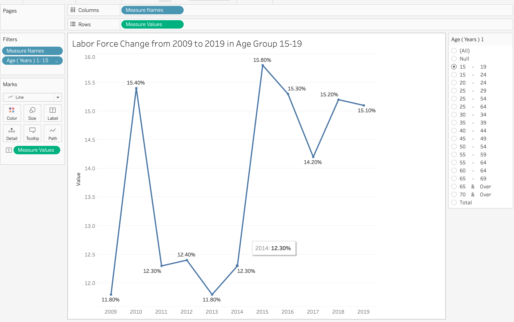

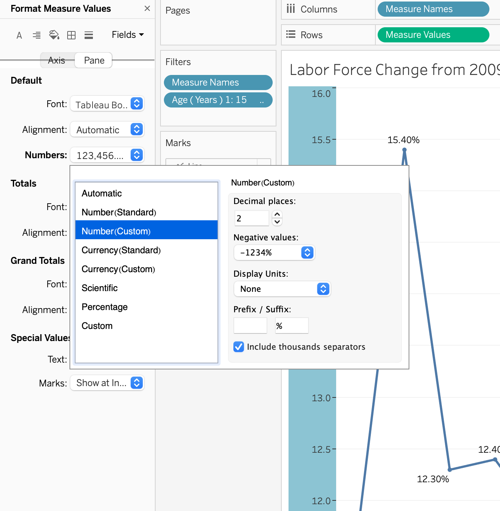

- Firstly, the X-axis is year, and the last axis is percentage. This graph is actually an auxiliary graph of the bar chart above. Bar chart has the effect of overview, and the graph directly tells the audience what the change trend of ten years in a certain age group

- At the same time, I changed the format of Y axis into percentage, and added the label of each point to make it clearly to observe

## **Pyramid Chart**
I use Pyramid chart to compare gender differences in labor, but since male and female are in two tables, I use Excel to put male and female in the same column, as shown in the figure below.
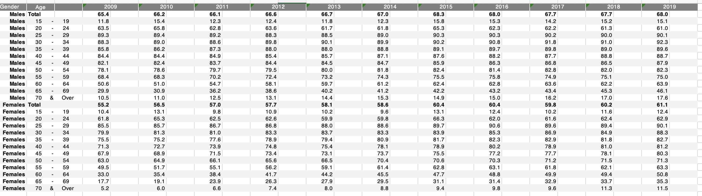

Then import into Tableau and we use Pivot function to combine year into one column, then table show as below.
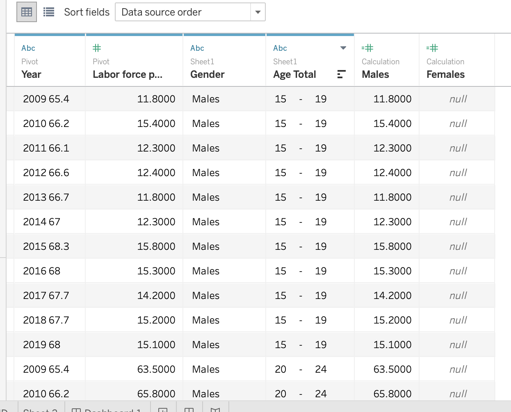

And we use Analysis -> create calculation field to create Females and Males variable
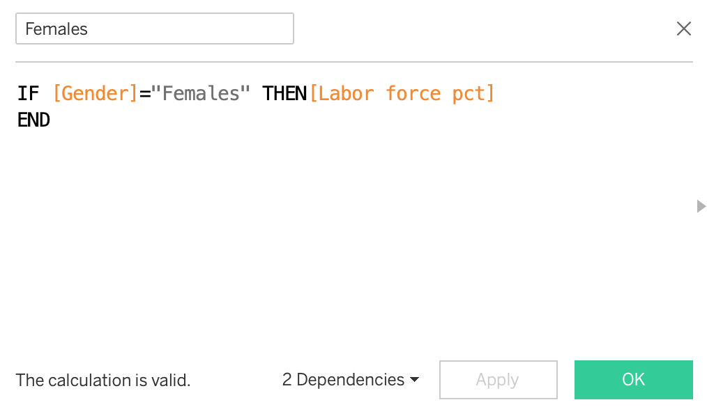

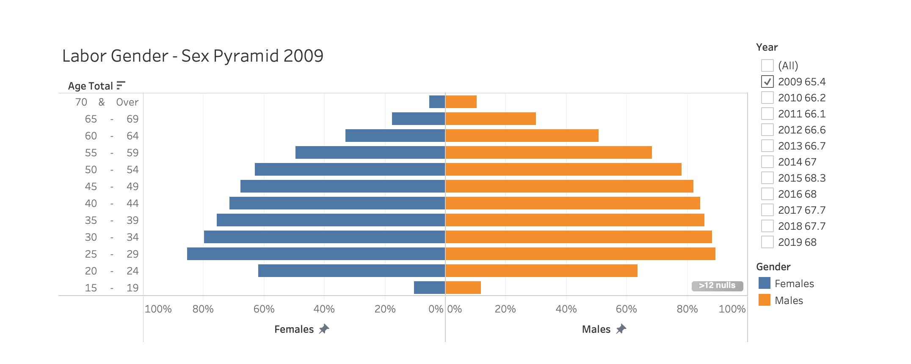

At the same time, you also find that I change age into descending, and the label format of Y axis into percentage, all of which make the graph more intuitive.

Also, year, as a filter, can flexibly compare the gender ratio of labor force in any year

# d.	 Three Major Observations Revealed by the Data Visualization on Each Graph

### Bar chart on total labor force difference between 2009 and 2019 


- The biggest difference was among those aged 65 to 69, with the labor force growing by nearly 16.3 percent in 2019
- Only in the age group of 20 to 24 did the percentage of the labor force decrease
- The percentage of the labor force as a whole is on the rise


### Line Chart on Labor Force Change from 2009 to 2019 between Age Group 15-19
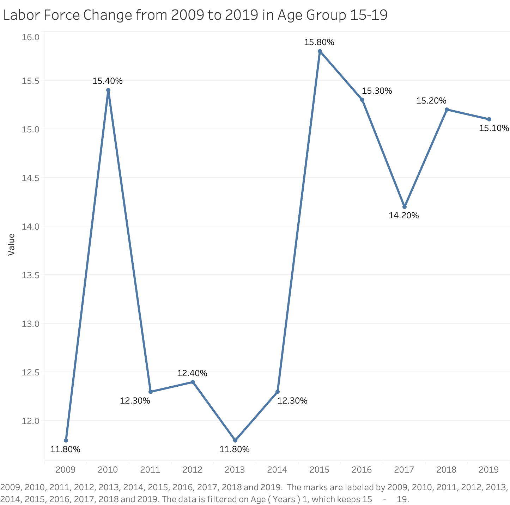

- The percentage of the labor force was the highest in 2015 and reached 15.8 percent
- The percentage of the labor force fell sharply from 2010 to 2011
- The percentage of the labor force rose sharply from 2014 to 2015

### Pyramid Chart


- The female workforce is substantially higher than the male workforce at ages above 65

- The male labor force is highest in the 25-29 age group and reach 86 percent

- The female labor force is highest in the 25-29 age group and reach 89 percent


